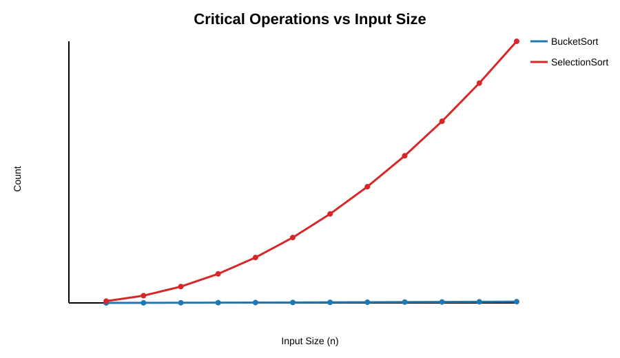
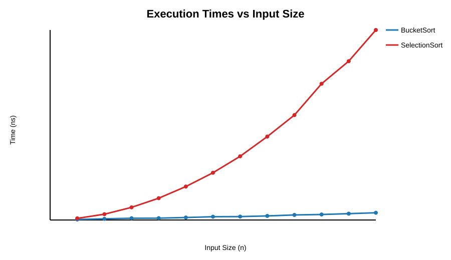
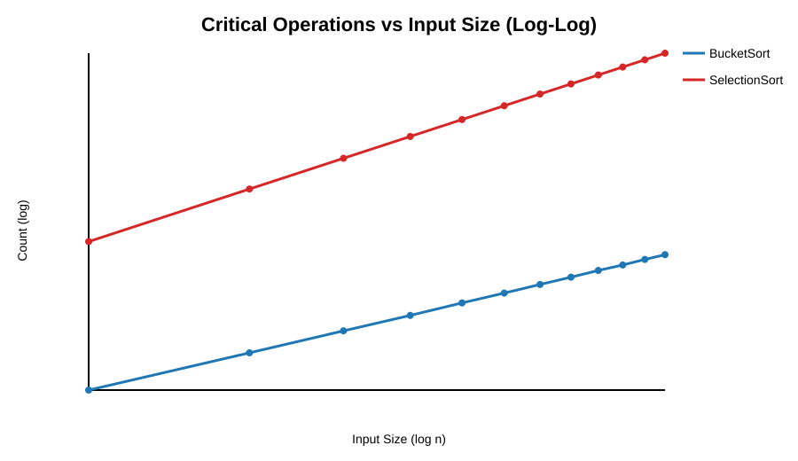
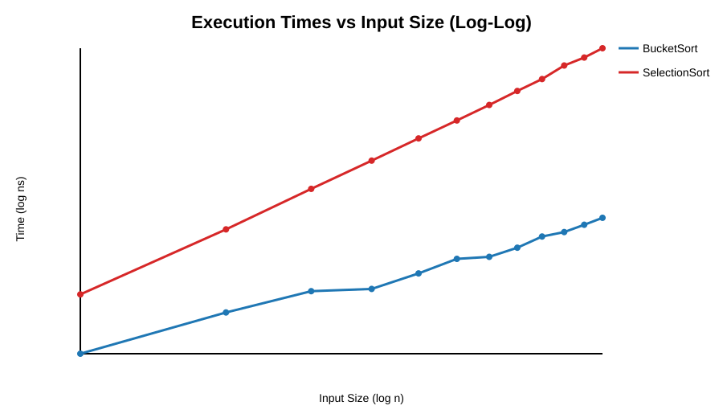

# CMSC 451 — Project 2 Consolidated Report

**Author:** Matthew Lukenich  
**Course:** CMSC 451  
**Algorithms analyzed:** BucketSort and SelectionSort  
**Reference implementation:** `CMSC451_Project1_Submission`

---

## 1) Assignment-Coverage Checklist

This single document consolidates the Project 2 deliverable requirements and the analysis.

| Project 2 Requirement | Covered In |
|---|---|
| Brief introduction of both sorting algorithms | Sections 2.1 and 2.2 |
| High-level pseudocode | Sections 2.1 and 2.2 |
| Big-Θ analysis | Section 2.3 |
| JVM warm-up approach | Section 3.2 |
| Critical operation definitions and rationale | Section 3.3 |
| Graphs of critical operations and execution times | Section 4.1 |
| Performance comparison | Section 4.2 |
| Critical operations vs measured time | Section 4.3 |
| Coefficient of variance significance and data sensitivity | Section 4.4 |
| Comparison to Big-Θ expectations | Section 4.5 |
| Conclusion | Section 5 |
| Revised code (if needed) | `Project2/analyze_results.py` (portable path + validation fixes) |

---

## 2) Sorting Algorithms Overview

### 2.1 BucketSort (integer range bucketing + insertion sort in buckets)

```text
BUCKET_SORT(A):
  if |A| <= 1: return
  min, max <- scan A
  if min == max: return

  k <- floor(sqrt(|A|))
  create k empty buckets

  for each value x in A:
    count++
    idx <- floor((x - min) * k / (max - min + 1))
    place x into bucket[idx]

  for each bucket B:
    INSERTION_SORT(B):
      for i from 1 to |B|-1:
        key <- B[i]
        j <- i-1
        while j >= 0:
          count++
          if B[j] > key:
            B[j+1] <- B[j]
            j <- j-1
          else:
            break
        B[j+1] <- key

  concatenate buckets back into A
```

### 2.2 SelectionSort

```text
SELECTION_SORT(A):
  n <- |A|
  for i from 0 to n-2:
    min_idx <- i
    for j from i+1 to n-1:
      count++
      if A[j] < A[min_idx]:
        min_idx <- j
    if min_idx != i:
      swap A[i], A[min_idx]
```

### 2.3 Big-Θ analysis

- **SelectionSort**
  - Comparison count is deterministic: `n(n-1)/2`.
  - Runtime is `Θ(n²)` in best/average/worst case.
- **BucketSort in this implementation**
  - Uses `k = floor(sqrt(n))` buckets.
  - Distribution phase: `Θ(n)`.
  - Intra-bucket insertion sorting cost: `Θ(sum(b_i²))`.
  - Under roughly uniform random distribution, `sum(b_i²) ≈ n²/k`, so expected growth is `Θ(n^(3/2))`.
  - Worst case remains `Θ(n²)` if values cluster heavily.

---

## 3) Experiment and Measurement Methodology

### 3.1 Benchmark setup

- Input sizes: `1000` to `12000` (step `1000`)
- Runs per size: `40`
- Data: random Java `int` values
- Algorithms benchmarked on identical per-run inputs (copied arrays)
- Sortedness verified after every run

### 3.2 JVM warm-up strategy

Warm-up was explicitly performed before recording benchmark results:

- warm-up array size: `100`
- warm-up iterations: `10,000`
- both algorithms warmed separately

This reduces timing bias from JVM startup and JIT compilation.

### 3.3 Critical operations counted

- **SelectionSort:** one increment per inner-loop comparison (`if list[j] < list[minIdx]`)
- **BucketSort:**
  - one increment per distribution placement into a bucket
  - one increment per insertion-sort comparison inside a bucket

These choices track the dominant work for each implementation.

---

## 4) Results and Analysis

### 4.1 Required graphs

#### Linear scale




#### Log-log scale




### 4.2 Mean summary table (counts, time, CV)

| n | Bucket mean count | Bucket CV count (%) | Bucket mean time (ns) | Bucket CV time (%) | Selection mean count | Selection CV count (%) | Selection mean time (ns) | Selection CV time (%) |
|---:|---:|---:|---:|---:|---:|---:|---:|---:|
| 1000 | 9,923.58 | 1.64 | 56,402.50 | 21.35 | 499,500.00 | 0.00 | 176,777.50 | 3.27 |
| 2000 | 26,527.35 | 1.37 | 124,802.50 | 23.01 | 1,999,000.00 | 0.00 | 618,540.00 | 3.46 |
| 3000 | 47,373.15 | 1.16 | 188,055.00 | 14.41 | 4,498,500.00 | 0.00 | 1,349,675.00 | 2.05 |
| 4000 | 71,185.90 | 1.01 | 196,362.50 | 7.64 | 7,998,000.00 | 0.00 | 2,324,697.50 | 2.53 |
| 5000 | 98,994.15 | 1.03 | 264,782.50 | 18.49 | 12,497,500.00 | 0.00 | 3,567,397.50 | 4.25 |
| 6000 | 128,355.45 | 0.91 | 350,490.00 | 88.81 | 17,997,000.00 | 0.00 | 5,040,242.50 | 5.66 |
| 7000 | 161,011.50 | 0.60 | 364,370.00 | 14.49 | 24,496,500.00 | 0.00 | 6,793,427.50 | 9.57 |
| 8000 | 195,231.10 | 0.61 | 434,432.50 | 12.33 | 31,996,000.00 | 0.00 | 8,895,362.50 | 8.88 |
| 9000 | 233,106.05 | 0.68 | 538,950.00 | 37.75 | 40,495,500.00 | 0.00 | 11,188,605.00 | 7.91 |
| 10000 | 269,409.83 | 0.59 | 587,257.50 | 8.93 | 49,995,000.00 | 0.00 | 14,528,415.00 | 13.35 |
| 11000 | 311,640.35 | 0.61 | 675,937.50 | 5.91 | 60,494,500.00 | 0.00 | 16,934,647.50 | 10.36 |
| 12000 | 353,459.03 | 0.57 | 772,872.50 | 9.44 | 71,994,000.00 | 0.00 | 20,260,940.00 | 12.95 |

### 4.3 Performance comparison

BucketSort is faster across all tested input sizes, and the speedup grows with `n`:

- `n=1000`: `176,777.5 / 56,402.5 ≈ 3.13×`
- `n=6000`: `5,040,242.5 / 350,490 ≈ 14.38×`
- `n=12000`: `20,260,940 / 772,872.5 ≈ 26.22×`

This widening gap is consistent with BucketSort’s lower expected growth in this configuration.

### 4.4 Critical-operation growth vs observed runtime

- **SelectionSort counts** exactly match `n(n-1)/2` at all tested sizes (CV = `0%` for count).
- **SelectionSort time** fits `n²` very strongly (`R² = 0.9994`).
- **BucketSort counts** best match `n^1.5` (`R² = 0.9999`).
- **BucketSort time** also best matches `n^1.5` among tested models (`R² = 0.9927`).

### 4.5 Coefficient of variation (CV) and data sensitivity

Average CV values:

- BucketSort count CV: `0.90%`
- SelectionSort count CV: `0.00%`
- BucketSort time CV: `21.88%`
- SelectionSort time CV: `7.02%`

Interpretation:

- SelectionSort’s structure makes operation count data-insensitive for fixed `n`.
- BucketSort is more sensitive to value distribution and bucket occupancy.
- A major time outlier appears for BucketSort at `n=6000` (one run near `2,260,500 ns`), likely due to runtime/system interference rather than algorithmic correctness issues.

### 4.6 Model-fit metrics table (`R²`)

| Metric | Value |
|---|---:|
| bucket_count_r2_n | 0.9859 |
| bucket_count_r2_n1.5 | 0.9999 |
| bucket_count_r2_n2 | 0.9873 |
| bucket_count_r2_nlogn | 0.9919 |
| bucket_time_r2_n | 0.9832 |
| bucket_time_r2_n1.5 | 0.9927 |
| bucket_time_r2_n2 | 0.9784 |
| bucket_time_r2_nlogn | 0.9879 |
| selection_count_r2_n | 0.9477 |
| selection_count_r2_n1.5 | 0.9891 |
| selection_count_r2_n2 | 1.0000 |
| selection_count_r2_nlogn | 0.9596 |
| selection_time_r2_n | 0.9451 |
| selection_time_r2_n1.5 | 0.9875 |
| selection_time_r2_n2 | 0.9994 |
| selection_time_r2_nlogn | 0.9572 |

---

## 5) Conclusion

The results clearly show that SelectionSort follows `Θ(n²)` behavior, while this BucketSort implementation (`k = sqrt(n)` + insertion sort in buckets) demonstrates empirically lower growth consistent with `Θ(n^(3/2))` under random input distributions. Across the full measured range, BucketSort is consistently and increasingly faster.

The CV analysis also reinforces expected sensitivity differences: SelectionSort has deterministic comparison counts, while BucketSort reflects data-distribution effects and occasional runtime noise in wall-clock timings.

---

## 6) Reproducibility and Included Artifacts

### Data and analysis files

- `CMSC451_Project1_Submission/BucketSort.txt`
- `CMSC451_Project1_Submission/SelectionSort.txt`
- `Project2/analysis_summary.csv`
- `Project2/fit_metrics.txt`
- `Project2/critical_operations.svg`
- `Project2/critical_operations_log.svg`
- `Project2/execution_times.svg`
- `Project2/execution_times_log.svg`
- `Project2/analyze_results.py`

### Commands

```bash
python3 Project2/analyze_results.py
python3 Project2/embed_svgs_in_report.py
javac CMSC451_Project1_Submission/*.java
```

### Single-file version with embedded graphs

If you need one standalone file that *includes* the SVG graph content, generate:

- `Project2/Project2_Consolidated_Report_Embedded.md`

using:

```bash
python3 Project2/embed_svgs_in_report.py
```


